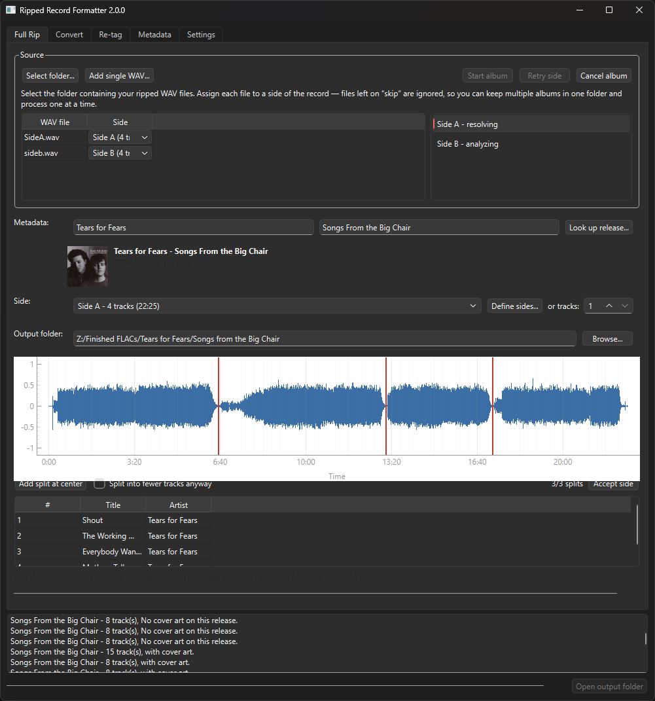

# Ripped Record Formatter

You play a record into it and get a finished album back. Ripped Record Formatter records the side, then turns that single enormous WAV into tagged tracks: it cleans the audio (rumble, mains hum, surface noise, clicks), works out where one track ends and the next begins, looks the release up on MusicBrainz to get the real tracklist, per-side structure and cover art, and encodes tagged FLACs — one side at a time or a whole multi-disc album in one run. It is a desktop app built for the actual shape of the job, which is why it asks you where a split goes when it genuinely cannot tell, instead of guessing and quietly mangling a track.



<!-- TODO(screenshot): docs/screenshot.png does not exist. An earlier capture was
     committed by accident and removed again — it showed the pre-rework UI (a
     standalone "Side-long WAV" field, an "Album mode" checkbox, a separate
     "Encode tracks" button), none of which exist any more. Capture the current
     Full Rip tab (folder selected, release looked up so the preview shows, one
     side mid-review with markers on the waveform), save it to
     docs/screenshot.png, and delete this comment. Until then this image is
     broken — do not make the repo public with it missing. -->

## Features

- **Recording.** Capture straight from any input device — turntable into a preamp into a line-in, or a USB interface — with live stereo level meters, peak-hold ticks and a clip indicator that *latches*, so you can set your input gain before you commit and still see afterwards that something clipped. Captures stream to disk (a side never sits in RAM), record to local staging and move to your folder on stop, and say so loudly if the audio has a dropout. Naming is side-aware: the next-file field pre-fills `SideA.wav` and advances to `SideB.wav` after each stop, because the thing you do between takes is flip the record, not type.
- **Restoration pipeline.** An ordered chain of independent stages — rumble filter (zero-phase subsonic high-pass), mains-hum removal (notch at the mains frequency and its harmonics), spectral-gating noise reduction profiled from the lead-in groove, and click/pop removal. Everything between stages is held as float, so a filter that overshoots full scale is not hard-clipped on the way to the next stage; the single conversion back to the source bit depth happens at the very end, with a headroom check that attenuates rather than clips.
- **Duration-anchored splitting.** Given the expected track durations from the release, the splitter predicts roughly where each gap should fall, searches a window around that prediction for the real silence, and re-anchors the next prediction on the gap it just confirmed — so turntable speed error, unknown lead-out deadspace and approximate CD-sourced durations never accumulate down the side. **When a window contains no convincing silence — a segue, a crossfade, a genuinely gapless transition — it does not invent a split. It hands you that one gap, with the search window highlighted on the waveform, and asks you to place it; the rest of the side is still resolved automatically.**
- **MusicBrainz lookup.** Search a release, pick the right pressing (vinyl is ranked above CD and studio albums above compilations, so the 1959 LP beats a later best-of), and pull down the per-side tracklist, track durations, MusicBrainz IDs and the front cover from the Cover Art Archive.
- **Album orchestration.** Point it at the folder of side WAVs, map each file to its side, and the whole record goes through in one run — sides analyse in the background while you review the one in front of you, and accepting a side starts its encode immediately. Tracks land flat in one output folder, numbered continuously across the album, while the *tags* keep per-side TRACKNUMBER/DISCNUMBER (the Picard vinyl convention). A side you just recorded appears in the mapping table on its own, already assigned to its side — record A, flip, record B, and the album job is mapped without you touching it. And a finished album shows a receipt: sides, sizes, warnings, and a link to the output folder.
- **Network-share friendly.** Rips usually live on a NAS. Every operation stages through a local temp directory — copy in, work locally, write results back — and cleans up after itself even on failure or cancellation.

## Installation

**Download it.** Grab the release zip, extract it anywhere, and run `RippedRecordFormatter.exe`. No Python, no ffmpeg, no installer — ffmpeg is bundled inside, and nothing is written outside the folder you extract.

The build is not code-signed, so Windows SmartScreen will warn you the first time: click *More info* → *Run anyway*. The download is around 470 MB, most of which is ffmpeg and Qt.

It is unsigned because code-signing economics are absurd for a personal tool — a certificate costs more per year than this project will ever cost to run. Verify your download against the **SHA-256 published with each release** instead: `Get-FileHash RippedRecordFormatter-<version>-win64.zip -Algorithm SHA256`, and check it matches the hash in the release notes.

**Or run it from source.** Requires **Python 3.14**.

```bash
git clone https://github.com/Conrad451/ripped-record-formatter.git
cd ripped-record-formatter
python -m venv .venv
.venv\Scripts\activate        # Windows;  source .venv/bin/activate on Unix
pip install -r requirements.txt
python app.py
```

From source, ffmpeg is fetched automatically on first use — see [Runtime requirements](build.md#runtime-requirements). To build the standalone bundle yourself, see [build.md](build.md).

## Usage

The happy path — start at **Record** if you are playing the record now, or at **Full Rip** if you already have the WAVs.

1. **Record the sides** (optional). In the **Record** tab, pick your input, watch the meters while you set gain, and press Record. Stop at the end of the side, flip the record, press Record again — the file name advances from `SideA.wav` to `SideB.wav` on its own, and each finished side appears in the Full Rip mapping table already assigned. *Or start from an existing folder of WAVs:* in **Full Rip**, select the folder holding this record's side WAVs. One row appears per WAV found. Set the side for each file that belongs to this record and leave the rest on **— skip —** — a folder can hold more than one album, and anything the app isn't sure about it leaves alone rather than guessing.
2. **Look up the release.** The preview shows the cover art — or warns you, loudly, if the release has none, while you can still do something about it.
3. **Press Start album.** Sides analyse in the background: restoration runs, then the splitter proposes cut points.
4. **Click a ready side to review it.** Adjust the split markers, and edit titles or per-track artists directly in the table.
5. **Press Accept side.** The side is cut, tagged and starts encoding immediately — while you get on with reviewing the next one.
6. **Collect your album.** Every track from every side lands flat in your output folder, numbered continuously.

A single WAV is just a one-row mapping table — use **Add single WAV…** instead of selecting a folder; everything after that is identical.

**Convert** and **Re-tag** are the simpler tabs for WAVs that are already one-file-per-track, or FLACs that just need their tags rewritten.

## Recording

An appliance, not an editor. Beyond choosing your input once and pressing Record, the whole interface is **level awareness** and **file naming** — the two things that quietly ruin a rip. There is no monitoring (Windows' own *Listen to this device* does that better), no live waveform, no editing.

The meters run whenever the Record tab is open, so you set gain against real bars before you commit to a take. Under them, a **level history strip** shows the last 30 seconds of per-channel peak against gridlines at 0 / −3 / −6 / −12 / −20 dBFS, with clip events marked in red at the top edge where they persist as the strip scrolls — so the loudest passage of the record is still on screen when you look, rather than something you had to catch in the act. The max peak is stated with the margin it leaves — *“max −4.2 dBFS (4.2 dB headroom)”* — and coloured green, amber or red as that margin runs out. The gain ritual is simply: play the loudest passage of the record, watch the strip and keep peaks below the −3 dBFS line. Clipping **latches** with a count — it is still lit when you look up — and a capture that clipped says so in the log: *"Clipping detected at 7 points — consider lowering input gain and re-recording this side."* A capture with a dropout is never shipped silently.

**Pin your sample rate once.** Windows' WASAPI reports the rate your device is *actually configured at*, which for a line input is often **192 kHz** even when the whole chain is 44.1k — so the rate box defaults to whatever the device advertises. Set it to **44100 Hz** once for a standard turntable chain; it is remembered.

**Record into a running album.** While an album job is running, a side recorded into its folder and assigned a side is admitted straight into the running job's analysis queue — it appears in the side list as queued→analyzing like any other, and the job now waits for it before concluding. Admission is open only while the job has not yet concluded. A finished album is finished: if every side had already reached a terminal state and the job concluded before the recording landed, the late side is simply mapped into the table (exactly as when no job is running) and the log says to press Start album to run again including it — jobs are never held open speculatively on the chance another side is coming. If no job is running at all, a completed recording is only mapped; the app never auto-starts a job the user didn't start. A recording that ended with warnings (a dropout, clipping) still admits normally, and the warning is carried forward into the admitted side's log line. Cancelling the album also cancels any admitted side still in flight.

**Sides map themselves when the answer is knowable.** Mapping re-runs whenever the WAV list or the release changes — including a release looked up *after* you scanned the folder — and only ever fills rows still on skip, so a choice you made by hand is never overwritten. It works down a confidence ladder and never guesses: an explicit side in the filename (`SideA`, `side_2`, a lone `A`); failing that, an unambiguous count-and-order (exactly as many unmapped WAVs as unmapped sides, with sortable names, mapped in order); failing that, a duration match (a WAV within ~5% of exactly one side's expected length, with no closer competitor — shown with a tooltip explaining why). Anything still ambiguous stays on skip for you to place.

**A clean slate between albums.** When an album finishes, the app clears its identity for the next record — the Artist and Album fields, the looked-up release and its cover, the side layout and the mapping table all reset, because no default is safe for identity: inheriting the last album's artist or release would quietly mistag the next one. The source and output folders are the exception — each follows a policy you set under **Settings → Default folders**: keep the last-used folder (the default), reset it to a folder you nominate, or clear it, so a location can persist across records even though identity never does. The finished-album receipt card carries a **Run this album again** button that restores everything just cleared in one click and re-arms Start, so redoing the record you just finished never means re-entering it. And if you are part-way through recording the next side when the album concludes, the clear waits until that capture has landed — a recording in flight is never orphaned by the reset.

## How it works

Everything that matters lives in `core/`, which is completely UI-agnostic: no printing, no prompting, no Qt. It exposes plain dataclasses and functions that take callbacks for progress, and the Qt layer in `gui/` is a thin driver on top — which is what makes the core testable against synthetic rips and reusable from a future CLI.

The splitting design is the interesting part. Expected durations only locate a gap to within *seconds* — turntable speed drifts by a percent or two and it compounds, deadspace between tracks is unknown, and CD-sourced durations do not exactly match a vinyl pressing — so durations are used to define a **search window** rather than a cut point, and energy analysis finds the true silence inside it. Every confirmed gap becomes the anchor for the next prediction, which is what stops the error from accumulating across a side; a window with no qualifying silence is reported as unresolved rather than forced.

## Tags written

Written as FLAC Vorbis comments. **A field that is absent writes no tag at all** — never an empty string. The base four are always present; the rest appear only when a release has been looked up.

| Tag | Source | Notes |
| --- | --- | --- |
| `ARTIST` | Per-track artist, falling back to the release artist | Handles splits and various-artists releases |
| `ALBUM` | Release title | |
| `TITLE` | Track title | |
| `TRACKNUMBER` | Position within the side | Resets on each side (Picard vinyl convention) |
| `ALBUMARTIST` | Release artist | |
| `DATE` | Release year | |
| `TRACKTOTAL` | Number of tracks **on that side** | Per-side, not the whole release |
| `DISCNUMBER` | Side / medium position | Side A = 1, side B = 2, … |
| `DISCTOTAL` | Number of sides in the release | |
| `MUSICBRAINZ_ALBUMID` | Release MBID | |
| `MUSICBRAINZ_ARTISTID` | Track artist MBID, falling back to the release artist MBID | |
| `MUSICBRAINZ_RECORDINGID` | Recording MBID | |
| `MUSICBRAINZ_TRACKID` | Release-track MBID | |
| `RRF_VERSION` | App version (`core/version.py`) at encode time | Provenance: records which build wrote the file |
| `RRF_RESTORATION` | Stable, parseable summary of the restoration applied to the audio, or `none` | Provenance: records how the audio was restored; format is documented as stable in `core/restoration.format_restoration` |
| Front cover image | Cover Art Archive | Embedded as a FLAC picture block, type 3 (front cover) |

The two `RRF_*` fields are written only when the app *encodes* the audio (Full Rip, plain Convert) — re-tagging carries forward whatever the original encode stamped and never rewrites them, so a re-tag cannot erase or falsify provenance.

## Roadmap & known limits

- **Gapless sides need you.** A side mixed as a continuous piece — segues, crossfades, live recordings with applause bridging tracks — has no silence to find. The splitter will tell you which gaps it could not resolve and let you place them by hand, but it will not place them for you. This is deliberate: a wrong automatic cut in the middle of a track is worse than being asked.
- **Defaults are conservative.** Noise reduction in particular is tuned to under-process rather than risk the gurgling artefacts of an aggressive spectral gate. If your pressing is rough, turn it up in **Settings** — every threshold, cutoff and weight is exposed there rather than buried in the code.
- **Recording is Windows-first in practice.** The capture layer is PortAudio (via `sounddevice`) and is not OS-specific, but the device quirks documented above — and the testing — are Windows/WASAPI.
- **The build is not code-signed.** Windows SmartScreen warns on first run until it is.
- **No command-line interface.** The app is GUI-only for now; `core/` is deliberately UI-agnostic so a CLI can be added without touching the logic.

## License

[GNU AGPLv3](LICENSE). In plain English: you can use, modify and share this freely, but if you distribute it — or run a modified version as a network service — you have to make your source available under the same terms.

## Acknowledgments

Release metadata comes from [MusicBrainz](https://musicbrainz.org/) and cover art from the [Cover Art Archive](https://coverartarchive.org/). Lookups use MusicBrainz's free service under [its terms of use](https://musicbrainz.org/doc/MusicBrainz_API), which ask that clients identify themselves and stay within one request per second — this app throttles itself accordingly. **If you do a lot of lookups, set your own contact in Settings** ("MusicBrainz contact"): it tells MusicBrainz who to reach about your traffic, rather than leaving it anonymous, and it is the courteous thing to do when you are leaning on somebody's free service. Audio decoding and click removal lean on [ffmpeg](https://ffmpeg.org/). The app stands on [PySide6](https://doc.qt.io/qtforpython/) (Qt), [NumPy](https://numpy.org/), [SciPy](https://scipy.org/), [soundfile](https://python-soundfile.readthedocs.io/), [noisereduce](https://github.com/timsainb/noisereduce), [mutagen](https://mutagen.readthedocs.io/), [pydub](https://github.com/jiaaro/pydub), [musicbrainzngs](https://python-musicbrainzngs.readthedocs.io/), and [pyqtgraph](https://www.pyqtgraph.org/).
